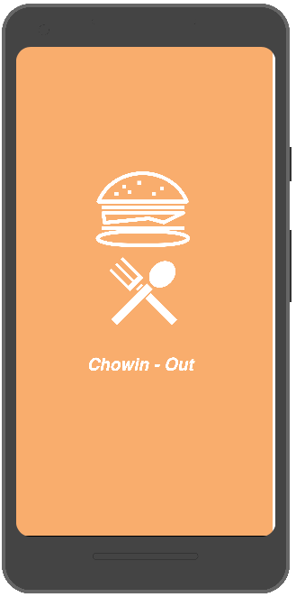
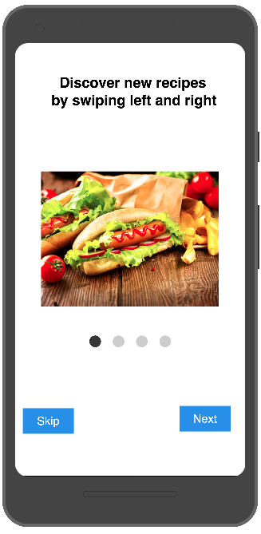
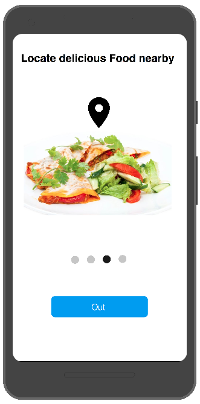
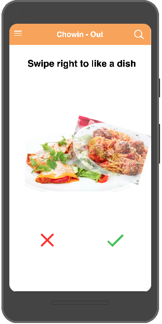
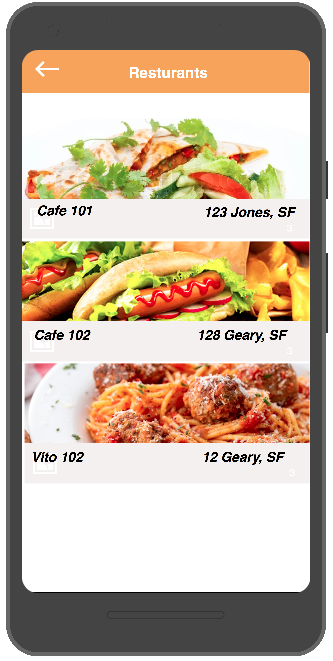
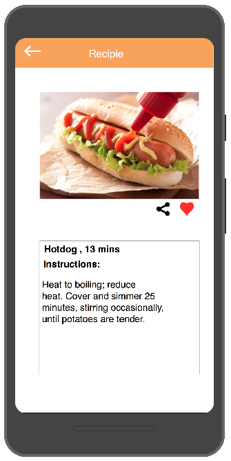
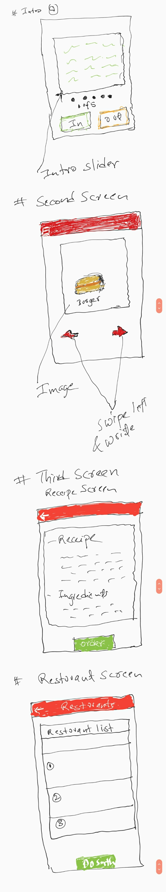

# Chowin.. out

**Demo Expo**:
https://expo.io/@jkhusanov/chowin-out

## Milestone #1

### Screenshots of UI Prototype 

  
  
  

  
  
  

### TODO

- [x] Wireframes
  - [x] :star: **Bonus:** Sketch layout and design
  - [x] :star: **Bonus:** Create a logo
- [x] Functionality
  * App allows user to choose either **IN** - cook yourself or **OUT** option - go to restaurant 
  * App offers popular random food, can have search and filters
  * Based on what option the user has chosen in the first screen app shows either food recipe (IN) or restaurants list (OUT)
  - [ ] :star: **Bonus:** Optional functionally
    * Ordering food ingredients with Instacart
    * Requesting Uber ride to the restaurant
- [x] API’s used
  * [Yummly API](https://developer.yummly.com/) for food information, images, recipes 
  * [EatStreet API](https://developers.eatstreet.com/) discover local restaurants and their food
  * [Yelp API](https://www.yelp.com/developers) probably food and restaurants 
  * [Uber API](https://developer.uber.com/) used to request a ride
- [x] Setup ReactNavigation with placeholder screens - Publish to Expo
  - [x] Empty Screens
  - [x] Navigation
  - [ ] :star: **Bonus:** Redux for screens and navigation 
- [ ] Start building prototype
  - [ ] Get feedback

### WireFrames 

  

### Overview of Api calls 

### Week 1 (Prakash's weekly progress)
- [x] display static image in a flatlist 
- [x] rough draft of profile screen
- [x] finshed onboarding screen 
- [x] finished profile detail screen

### Week 1 (Jakhongir's weekly progress)

- [x] display static image in a snap-carousel

### Week 1 (Moni's weekly progress)
- [x] EatStreet API calls

### Week 1 (Nick's weekly progress)
- [x] Geolocation and connected with IntroScreen and FoodScreen

## Week 2 General TODO

- [ ] Polish the food display screen (Jahon)
- [ ] Restaurants list screen (Jahon)
- [ ] Restaurant screen (Jahon)

- [ ] Activity indicator for screens (Jahon) (Prakash)
- [ ] Polish food detail screen (Prakash)
- [ ] Async storage for intro, load once (Prakash)
- [ ] New icon (Prakash)

- [ ] Context API (Moni)
- [ ] EatStreet and Yummly API (Moni)

- [ ] Geolocation talk to EatStreet API (Nick)
- [ ] Yelp API getting restaurants from EatStreet API (Nick)