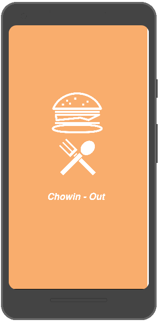
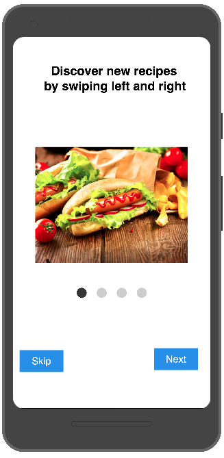
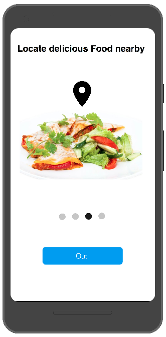
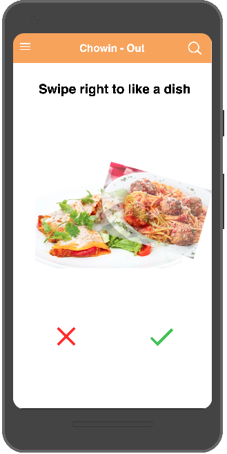
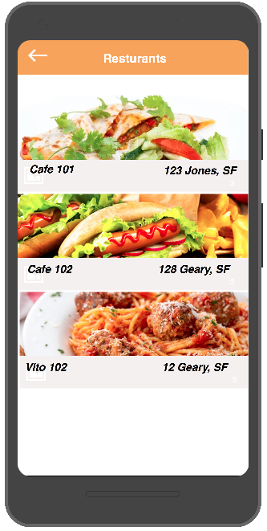

# Chowin.. out
**Demo Expo**:
https://expo.io/@jkhusanov/chowin-out
## Milestone #1

## Screenshots of UI Prototype 

  
  
  

  
  
  

### Todo

- [x] Wireframes
  - [ ] :star: **Bonus:** Sketch layout and design
  - [ ] :star: **Bonus:** Create a logo
- [ ] Functionality
  - [ ] Put app functionality here 
  - [ ] Connecting to the API
- [ ] API’s used
  - [ ] List APIs for each screen
- [x] Setup ReactNavigation with placeholder screens - Publish to Expo
  - [x] Empty Screens
  - [x] Navigation
  - [ ] :star: **Bonus:** Redux for screens and navigation 
- [ ] Start building prototype
  - [ ] Get feedback

# WireFrames 

  

