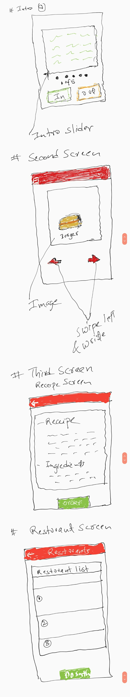

# Chowin.. out

## Todo

- [x] Wireframes 
- [ ] Empty UI screens
- [ ] Navigation
- [ ] Redux for screens and navigation 
- [ ] API for each screen
- [ ] Sketch layout and design
  - [ ] Create a logo
  - [ ] Explain overall sketch
- [ ] Start building prototype
  - [ ] Get feedback
- [ ] Connecting to the API

# WireFrames 

  

