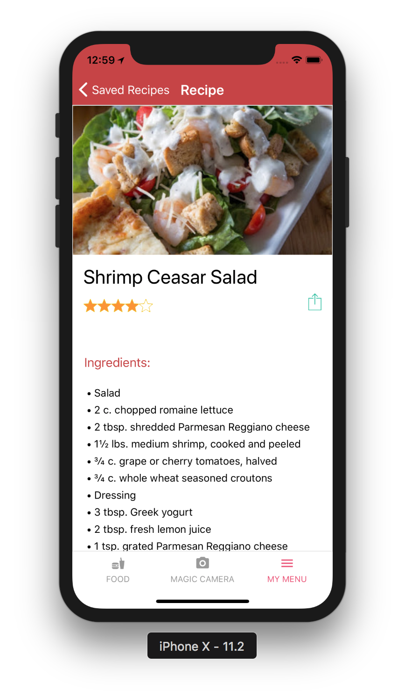

# Chowin-Out

  

<h3 align="center">
  Chowin-Out mobile app
</h3>

  Chowin-Out is your best friend to find food

### [Demo - Try it on Expo](https://expo.io/@jkhusanov/chowin-out)

## What's Chowin-Out?

**Chowin-Out is your best friend to find food**

- Users can  **discover new food around** and find a restaurant information that serves that food.
- In addition, they can **find food based on a photo** (like Shazam, powered by Machine Learning) and **get the recipe** for that food and cook it yourself. 
- They can also **save food** on their favorite list and **share** restaurant info or food recipe with their friends and family

### Demo and some screenshots

  
  
  

  
  
  

  
  
  

  
  
  
  

## Functionality
- Chowin-Out is a fully functioning food discovery app
- Users can get food local food based on location
- Users can find food recipes based on a photo
- Users can like and save foods
- Users can share information with their friends and family

Would like to implement dynamic seasonal tab to offer users to find food based on seasonal vegetables and fruits, and overall make the app more UI friendly and functional.

## Feedback

In case you have any feedback or questions, feel free to open a new issue on this repo or reach out to us [**@jkhusanov**](https://github.com/jkhusanov),[**@makkhay**](https://github.com/makkhay), [**@sukhjitsingh**](https://github.com/sukhjitsingh), and [**@niszeto**](https://github.com/niszeto) on Github.

## Milestones

Below you can see our milestones and how we achieved them

## Milestone #1

### Screenshots of UI Prototype 

  
  
  

  
  
  

### TODO

- [x] Wireframes
  - [x] :star: **Bonus:** Sketch layout and design
  - [x] :star: **Bonus:** Create a logo
- [x] Functionality
  * App allows user to choose either **IN** - cook yourself or **OUT** option - go to restaurant 
  * App offers popular random food, can have search and filters
  * Based on what option the user has chosen in the first screen app shows either food recipe (IN) or restaurants list (OUT)
  - [ ] :star: **Bonus:** Optional functionally
    * Ordering food ingredients with Instacart
    * Requesting Uber ride to the restaurant
- [x] API’s used
  * [Yummly API](https://developer.yummly.com/) for food information, images, recipes 
  * [EatStreet API](https://developers.eatstreet.com/) discover local restaurants and their food
  * [Yelp API](https://www.yelp.com/developers) probably food and restaurants 
  * [Uber API](https://developer.uber.com/) used to request a ride
- [x] Setup ReactNavigation with placeholder screens - Publish to Expo
  - [x] Empty Screens
  - [x] Navigation
  - [ ] :star: **Bonus:** Redux for screens and navigation 
- [x] Start building prototype
  - [x] Get feedback

### WireFrames 

  

### Overview of Api calls 

## Milestone #2

### Week 1 (Prakash's weekly progress)
- [x] display static image in a flatlist 
- [x] rough draft of profile screen
- [x] finshed onboarding screen 
- [x] finished profile detail screen

### Week 1 (Jakhongir's weekly progress)

- [x] display static image in a snap-carousel

### Week 1 (Moni's weekly progress)
- [x] EatStreet API calls

### Week 1 (Nick's weekly progress)
- [x] Geolocation and connected with IntroScreen and FoodScreen

## Milestone #3

## Week 2 General TODO

- [x] Polish the food display screen (Jahon)
- [x] Restaurants list screen (Jahon)
- [x] Restaurant screen (Jahon)

- [x] Activity indicator for screens (Jahon) (Prakash)
- [x] Polish food detail screen (Prakash)
- [x] Async storage for intro, load once (Prakash)
- [x] New icon (Prakash)

- [x] Context API (Moni)
- [x] EatStreet and Yummly API (Moni)

- [x] Geolocation talk to EatStreet API (Nick)
- [x] Yelp API getting restaurants from EatStreet API (Nick)

## Milestone #4

## Publish the app on mobile app stores

- [x] Publish on [Google Play](https://play.google.com/store/apps/details?id=com.makkhay.chowinout)
- [x] Publish on [App Store] (https://itunes.apple.com/us/app/chowin-out/id1399716122?mt=8)

## Milestone #5

## General improvements and new features

- [x] Fix the bugs and improve the app
- [x] Add magic camera for image recognition using [Clarifai](https://clarifai.com/)
- [x] Add attributions to API calling screens

